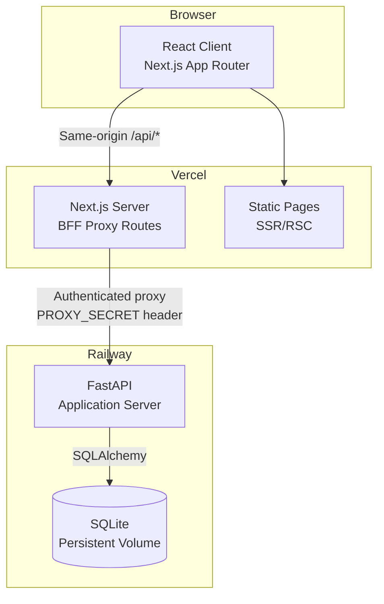
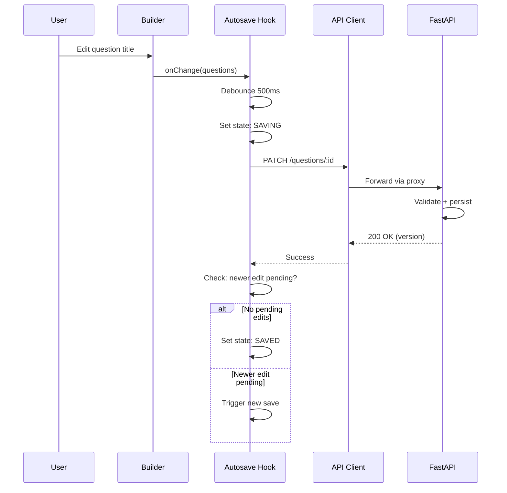
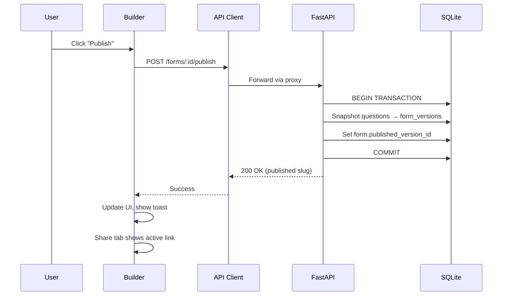
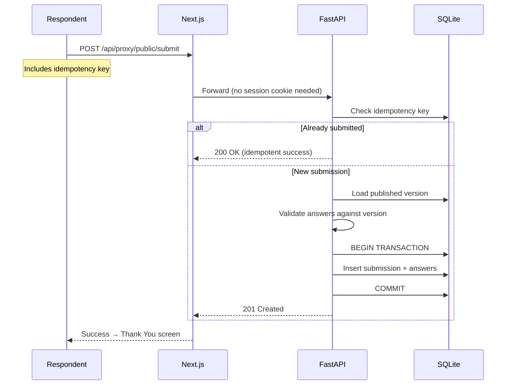
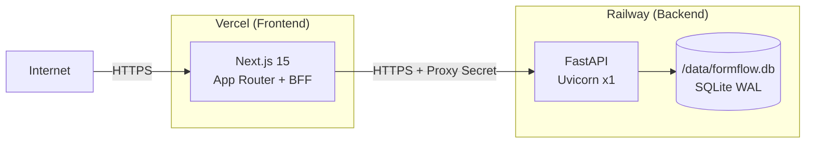

# FormFlow — Architecture

## 1. System Overview



## 2. Request Flow

### Creator Operations
```
Browser → Next.js /api/proxy/* → FastAPI /api/v1/*
         (adds PROXY_SECRET header,
          forwards session cookie)
```

### Public Respondent
```
Browser → Next.js /f/[slug] (SSR) → FastAPI /api/v1/public/forms/:slug
Browser → Next.js /api/proxy/public/* → FastAPI /api/v1/public/*
```

### Static Assets
```
Browser → Vercel CDN (Next.js static output)
```

## 3. Frontend Architecture

### Directory Structure
```
frontend/
├── src/
│   ├── app/                    # Next.js App Router pages
│   │   ├── layout.tsx          # Root layout
│   │   ├── page.tsx            # Workspace (forms list)
│   │   ├── forms/
│   │   │   └── [id]/
│   │   │       ├── edit/
│   │   │       │   └── page.tsx    # Builder
│   │   │       ├── share/
│   │   │       │   └── page.tsx    # Share tab
│   │   │       ├── results/
│   │   │       │   └── page.tsx    # Results summary
│   │   │       │   └── responses/
│   │   │       │       └── page.tsx # Responses table
│   │   │       └── preview/
│   │   │           └── page.tsx    # Preview
│   │   ├── f/
│   │   │   └── [slug]/
│   │   │       └── page.tsx        # Public respondent flow
│   │   └── api/
│   │       └── proxy/
│   │           └── [...path]/
│   │               └── route.ts    # BFF proxy
│   ├── components/
│   │   ├── ui/                 # Primitive UI components
│   │   │   ├── Button.tsx
│   │   │   ├── Input.tsx
│   │   │   ├── Dialog.tsx
│   │   │   ├── DropdownMenu.tsx
│   │   │   ├── Toast.tsx
│   │   │   ├── Badge.tsx
│   │   │   ├── Skeleton.tsx
│   │   │   └── ...
│   │   ├── workspace/          # Workspace feature components
│   │   │   ├── FormsTable.tsx
│   │   │   ├── FormRow.tsx
│   │   │   ├── FormActions.tsx
│   │   │   ├── CreateFormButton.tsx
│   │   │   ├── SearchInput.tsx
│   │   │   └── EmptyState.tsx
│   │   ├── builder/            # Builder feature components
│   │   │   ├── BuilderLayout.tsx
│   │   │   ├── BuilderHeader.tsx
│   │   │   ├── QuestionNavigator.tsx
│   │   │   ├── QuestionNavItem.tsx
│   │   │   ├── Canvas.tsx
│   │   │   ├── Inspector.tsx
│   │   │   ├── AddQuestionMenu.tsx
│   │   │   ├── TypePicker.tsx
│   │   │   └── AutosaveIndicator.tsx
│   │   ├── questions/          # Question type components
│   │   │   ├── registry.ts        # Question type registry
│   │   │   ├── editors/           # Builder-side editors
│   │   │   │   ├── ShortTextEditor.tsx
│   │   │   │   ├── LongTextEditor.tsx
│   │   │   │   ├── MultipleChoiceEditor.tsx
│   │   │   │   ├── DropdownEditor.tsx
│   │   │   │   ├── EmailEditor.tsx
│   │   │   │   ├── NumberEditor.tsx
│   │   │   │   ├── YesNoEditor.tsx
│   │   │   │   └── RatingEditor.tsx
│   │   │   └── renderers/         # Respondent-side renderers
│   │   │       ├── ShortTextRenderer.tsx
│   │   │       ├── LongTextRenderer.tsx
│   │   │       ├── MultipleChoiceRenderer.tsx
│   │   │       ├── DropdownRenderer.tsx
│   │   │       ├── EmailRenderer.tsx
│   │   │       ├── NumberRenderer.tsx
│   │   │       ├── YesNoRenderer.tsx
│   │   │       └── RatingRenderer.tsx
│   │   ├── respondent/         # Public form components
│   │   │   ├── RespondentFlow.tsx
│   │   │   ├── ProgressBar.tsx
│   │   │   ├── QuestionCard.tsx
│   │   │   ├── NavigationButtons.tsx
│   │   │   ├── ThankYouScreen.tsx
│   │   │   └── FormUnavailable.tsx
│   │   └── results/            # Results components
│   │       ├── ResultsSummary.tsx
│   │       ├── QuestionSummaryCard.tsx
│   │       ├── ResponsesTable.tsx
│   │       ├── ResponseDetail.tsx
│   │       └── charts/
│   │           ├── BarChart.tsx
│   │           └── RatingDistribution.tsx
│   ├── hooks/                  # Custom hooks
│   │   ├── useAutosave.ts
│   │   ├── useDebounce.ts
│   │   ├── useForms.ts
│   │   ├── useForm.ts
│   │   ├── useQuestions.ts
│   │   ├── useSubmission.ts
│   │   └── useKeyboard.ts
│   ├── lib/                    # Utilities and configuration
│   │   ├── api-client.ts       # Typed API client
│   │   ├── constants.ts        # App constants
│   │   ├── validation.ts       # Shared validation schemas
│   │   └── utils.ts            # Small utility functions
│   ├── types/                  # TypeScript type definitions
│   │   ├── form.ts
│   │   ├── question.ts
│   │   ├── submission.ts
│   │   └── api.ts
│   └── styles/
│       └── globals.css         # Design tokens + global styles
├── public/                     # Static assets
├── next.config.ts
├── tsconfig.json
├── vitest.config.ts
├── playwright.config.ts
└── package.json
```

### Key Patterns

**Server Components (RSC):** Used for layout shells and initial data fetching where appropriate.

**Client Components:** Used for interactive elements (builder, respondent flow, forms with state).

**TanStack Query:** Manages server state, caching, and mutations. Configured with:
- Stale time appropriate per resource
- Retry logic for failed requests
- Optimistic updates for responsive UI
- Query invalidation after mutations

**API Client:** Single typed module (`lib/api-client.ts`) that:
- Calls same-origin `/api/proxy/*` routes
- Handles response parsing
- Provides typed request/response
- Handles errors consistently

**Question Type Registry:** `components/questions/registry.ts` maps question types to:
- Editor component (builder)
- Renderer component (respondent)
- Icon
- Label
- Default settings
- Validation schema

This registry makes adding new question types a single-file addition + registry entry.

## 4. Backend Architecture

### Directory Structure
```
backend/
├── app/
│   ├── main.py                 # FastAPI app factory
│   ├── config.py               # Settings (env vars)
│   ├── database.py             # SQLAlchemy engine, session
│   ├── dependencies.py         # FastAPI dependencies
│   ├── middleware.py            # CORS, security headers, proxy auth
│   ├── exceptions.py           # Custom exceptions + handlers
│   ├── models/                 # SQLAlchemy ORM models
│   │   ├── __init__.py
│   │   ├── creator.py
│   │   ├── form.py
│   │   ├── question.py
│   │   ├── submission.py
│   │   └── session.py
│   ├── schemas/                # Pydantic request/response schemas
│   │   ├── __init__.py
│   │   ├── session.py
│   │   ├── form.py
│   │   ├── question.py
│   │   ├── submission.py
│   │   └── common.py
│   ├── routes/                 # API route handlers
│   │   ├── __init__.py
│   │   ├── session.py
│   │   ├── forms.py
│   │   ├── questions.py
│   │   ├── public.py
│   │   └── results.py
│   ├── services/               # Business logic
│   │   ├── __init__.py
│   │   ├── session_service.py
│   │   ├── form_service.py
│   │   ├── question_service.py
│   │   ├── submission_service.py
│   │   └── results_service.py
│   ├── repositories/           # Database access
│   │   ├── __init__.py
│   │   ├── form_repo.py
│   │   ├── question_repo.py
│   │   ├── submission_repo.py
│   │   └── session_repo.py
│   └── seed.py                 # Idempotent seed command
├── migrations/                 # Alembic migrations
│   ├── alembic.ini
│   ├── env.py
│   └── versions/
├── tests/
│   ├── conftest.py
│   ├── test_sessions.py
│   ├── test_forms.py
│   ├── test_questions.py
│   ├── test_submissions.py
│   ├── test_results.py
│   ├── test_security.py
│   └── test_validation.py
├── pyproject.toml
└── uv.lock
```

### Key Patterns

**Layered Architecture:**
```
Routes → Services → Repositories → Database
  ↓         ↓            ↓
Schemas   Domain      ORM Models
(Pydantic) Rules      (SQLAlchemy)
```

- **Routes:** Parse request, validate with Pydantic, delegate to service, return response
- **Services:** Business logic, authorization checks, transaction coordination
- **Repositories:** Database queries and mutations via SQLAlchemy ORM
- **Models:** SQLAlchemy table definitions with constraints and relationships

**Dependency Injection:** FastAPI `Depends()` for:
- Database session (per-request)
- Current creator (from session cookie)
- Proxy authentication (from header)

**Error Handling:** Custom exception classes mapped to RFC 9457 Problem Details responses via exception handlers.

## 5. BFF Proxy Design

The Next.js BFF proxy (`/api/proxy/[...path]`) handles:
1. Reads session cookie from browser request
2. Forwards to FastAPI with `X-Proxy-Secret` header
3. Allowlists specific path patterns and methods
4. Enforces body size limits
5. Strips untrusted headers
6. Returns FastAPI response to browser

**Security constraints:**
- Proxy secret is server-only env var
- User input never controls upstream URL
- Only known paths are forwarded
- Hop-by-hop headers are stripped

## 6. State Management

### Builder State
```
TanStack Query (server state)
  ├── Form data (title, status)
  ├── Questions list
  └── Published version info

React state (UI state)
  ├── Selected question ID
  ├── Autosave state machine
  ├── Preview mode
  ├── Drag state
  └── Inspector panel state
```

### Respondent State
```
React state (local)
  ├── Current question index
  ├── Answers map (questionId → value)
  ├── Validation errors
  ├── Navigation direction
  ├── Submission state
  └── Idempotency key (sessionStorage)
```

## 7. Data Flow Diagrams

### Autosave Flow


### Publish Flow


### Submission Flow


## 8. Deployment Topology



**Constraints:**
- Single Uvicorn worker on Railway (SQLite limitation)
- Persistent volume at `/data` for database
- WAL mode enabled for better read concurrency
- No horizontal scaling of writers
