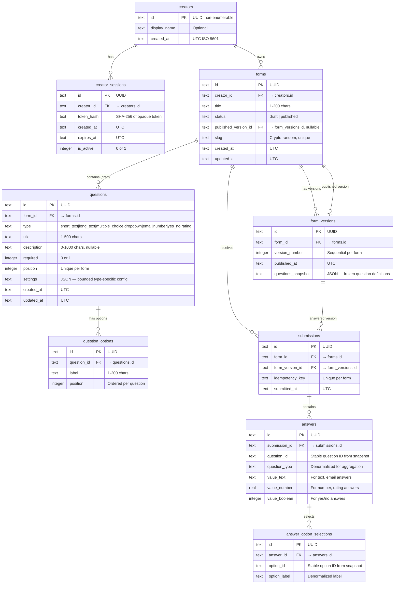

# FormFlow — Database Design

## 1. Entity-Relationship Diagram



## 2. Table Details

### `creators`
| Column | Type | Constraints |
|---|---|---|
| id | TEXT | PK, UUID v4 |
| display_name | TEXT | DEFAULT 'Demo Creator' |
| created_at | TEXT | NOT NULL, UTC ISO 8601 |

### `creator_sessions`
| Column | Type | Constraints |
|---|---|---|
| id | TEXT | PK, UUID v4 |
| creator_id | TEXT | FK → creators.id ON DELETE CASCADE, NOT NULL |
| token_hash | TEXT | NOT NULL, UNIQUE |
| created_at | TEXT | NOT NULL, UTC |
| expires_at | TEXT | NOT NULL, UTC |
| is_active | INTEGER | NOT NULL, DEFAULT 1, CHECK(is_active IN (0, 1)) |

**Indexes:** `idx_sessions_token_hash`, `idx_sessions_creator_id`, `idx_sessions_expires_at`

### `forms`
| Column | Type | Constraints |
|---|---|---|
| id | TEXT | PK, UUID v4 |
| creator_id | TEXT | FK → creators.id ON DELETE CASCADE, NOT NULL |
| title | TEXT | NOT NULL, DEFAULT 'Untitled form', CHECK(length(title) BETWEEN 1 AND 200) |
| status | TEXT | NOT NULL, DEFAULT 'draft', CHECK(status IN ('draft', 'published')) |
| published_version_id | TEXT | FK → form_versions.id, NULLABLE |
| slug | TEXT | NOT NULL, UNIQUE, crypto-random |
| created_at | TEXT | NOT NULL, UTC |
| updated_at | TEXT | NOT NULL, UTC |

**Indexes:** `idx_forms_creator_id`, `idx_forms_slug` (UNIQUE), `idx_forms_status`, `idx_forms_updated_at`

### `form_versions`
| Column | Type | Constraints |
|---|---|---|
| id | TEXT | PK, UUID v4 |
| form_id | TEXT | FK → forms.id ON DELETE CASCADE, NOT NULL |
| version_number | INTEGER | NOT NULL |
| published_at | TEXT | NOT NULL, UTC |
| questions_snapshot | TEXT | NOT NULL, JSON — frozen question definitions |

**Unique:** `(form_id, version_number)`
**Indexes:** `idx_versions_form_id`

### `questions`
| Column | Type | Constraints |
|---|---|---|
| id | TEXT | PK, UUID v4 |
| form_id | TEXT | FK → forms.id ON DELETE CASCADE, NOT NULL |
| type | TEXT | NOT NULL, CHECK(type IN ('short_text', 'long_text', 'multiple_choice', 'dropdown', 'email', 'number', 'yes_no', 'rating')) |
| title | TEXT | NOT NULL, DEFAULT 'Untitled question', CHECK(length(title) BETWEEN 1 AND 500) |
| description | TEXT | NULLABLE, CHECK(description IS NULL OR length(description) <= 1000) |
| required | INTEGER | NOT NULL, DEFAULT 0, CHECK(required IN (0, 1)) |
| position | INTEGER | NOT NULL, CHECK(position >= 0) |
| settings | TEXT | DEFAULT '{}', JSON — bounded type-specific config |
| created_at | TEXT | NOT NULL, UTC |
| updated_at | TEXT | NOT NULL, UTC |

**Unique:** `(form_id, position)` — enforced transactionally during reorder
**Indexes:** `idx_questions_form_id`, `idx_questions_form_position`

### `question_options`
| Column | Type | Constraints |
|---|---|---|
| id | TEXT | PK, UUID v4 |
| question_id | TEXT | FK → questions.id ON DELETE CASCADE, NOT NULL |
| label | TEXT | NOT NULL, CHECK(length(label) BETWEEN 1 AND 200) |
| position | INTEGER | NOT NULL, CHECK(position >= 0) |

**Unique:** `(question_id, position)`
**Indexes:** `idx_options_question_id`

### `submissions`
| Column | Type | Constraints |
|---|---|---|
| id | TEXT | PK, UUID v4 |
| form_id | TEXT | FK → forms.id ON DELETE RESTRICT, NOT NULL |
| form_version_id | TEXT | FK → form_versions.id ON DELETE RESTRICT, NOT NULL |
| idempotency_key | TEXT | NOT NULL |
| submitted_at | TEXT | NOT NULL, UTC |

**Unique:** `(form_id, idempotency_key)` — prevents duplicate submissions
**Indexes:** `idx_submissions_form_id`, `idx_submissions_form_version_id`, `idx_submissions_submitted_at`

### `answers`
| Column | Type | Constraints |
|---|---|---|
| id | TEXT | PK, UUID v4 |
| submission_id | TEXT | FK → submissions.id ON DELETE CASCADE, NOT NULL |
| question_id | TEXT | NOT NULL — stable ID from snapshot |
| question_type | TEXT | NOT NULL — denormalized for aggregation |
| value_text | TEXT | NULLABLE |
| value_number | REAL | NULLABLE |
| value_boolean | INTEGER | NULLABLE, CHECK(value_boolean IS NULL OR value_boolean IN (0, 1)) |

**Indexes:** `idx_answers_submission_id`, `idx_answers_question_id`

### `answer_option_selections`
| Column | Type | Constraints |
|---|---|---|
| id | TEXT | PK, UUID v4 |
| answer_id | TEXT | FK → answers.id ON DELETE CASCADE, NOT NULL |
| option_id | TEXT | NOT NULL — stable ID from snapshot |
| option_label | TEXT | NOT NULL — denormalized label |

**Indexes:** `idx_selections_answer_id`

## 3. Versioning Design

### Draft Editing
- The `questions` table always represents the **current draft** of a form
- Edits modify `questions` directly (with autosave)
- No published form is affected by draft edits

### Publishing
1. Snapshot all current `questions` + `question_options` as JSON into `form_versions.questions_snapshot`
2. Create a new `form_versions` row with incremented `version_number`
3. Set `forms.published_version_id` to the new version
4. Set `forms.status` to 'published'
5. All in a single transaction

### Questions Snapshot Format
```json
[
  {
    "id": "uuid-of-question",
    "type": "multiple_choice",
    "title": "What is your role?",
    "description": "Select the option that best describes you",
    "required": true,
    "position": 0,
    "settings": {},
    "options": [
      {"id": "uuid-of-option", "label": "Developer", "position": 0},
      {"id": "uuid-of-option", "label": "Designer", "position": 1}
    ]
  }
]
```

### Response Binding
- `submissions.form_version_id` → the exact version the respondent answered
- Answer `question_id` and `option_id` reference IDs from the snapshot
- Historical responses remain valid even after form edits

### Unpublishing
- Set `forms.status` to 'draft'
- Set `forms.published_version_id` to NULL
- `form_versions` and `submissions` are **preserved**
- Public form returns "unavailable"
- Re-publishing creates a new version, restores the same slug

## 4. Deletion Behavior

| Entity | Behavior |
|---|---|
| Creator deleted | CASCADE: sessions, forms, versions, questions, submissions, answers |
| Form deleted | CASCADE: questions, options, versions; RESTRICT if submissions exist → soft-delete or cascade |
| Question deleted | CASCADE: options |
| Submission deleted | CASCADE: answers, selections |
| Form version | Never deleted independently |

**Decision:** Form deletion cascades submissions for simplicity in this demo. In production, soft delete or archive would be preferred.

## 5. Index Strategy

Indexes optimize:
- Session lookup by token hash
- Forms by creator (workspace listing)
- Forms by slug (public access)
- Questions by form + position (ordered retrieval)
- Options by question (choice retrieval)
- Submissions by form (results listing)
- Submissions by form + idempotency key (duplicate prevention)
- Answers by submission (response retrieval)
- Answers by question_id (aggregation queries)

## 6. Integrity Constraints

- All IDs are UUID v4 (non-enumerable)
- Foreign keys enabled via `PRAGMA foreign_keys = ON`
- Check constraints on enum columns (status, type, required)
- Check constraints on string lengths
- Unique constraints on (form_id, position) for questions
- Unique constraints on (form_id, idempotency_key) for submissions
- Unique constraint on form slug
- All timestamps stored as UTC ISO 8601 strings

## 7. Transaction Boundaries

| Operation | Transaction Scope |
|---|---|
| Create form | Single insert |
| Update question | Single update with version check |
| Reorder questions | Update all positions atomically |
| Publish form | Snapshot + version insert + form update |
| Submit response | Submission + all answers + selections |
| Duplicate form | New form + copy all questions + options |
| Delete form | Form + cascaded children |

## 8. SQLite Production Configuration

```python
# Connection setup
PRAGMA journal_mode = WAL;
PRAGMA foreign_keys = ON;
PRAGMA busy_timeout = 5000;
PRAGMA synchronous = NORMAL;  # Safe with WAL
```

**Deployment constraints:**
- Database file at `/data/formflow.db` (Railway persistent volume)
- Single Uvicorn worker (one writer)
- No horizontal SQLite writers
- WAL mode for concurrent reads during writes
- Busy timeout for lock contention
- Backup: file copy of `.db`, `.db-wal`, `.db-shm` during low traffic

## 9. Seed Data Strategy

**Command:** `uv run python -m app.seed`

**Idempotent:** checks for existence before creating.

**Creates:**
- 1 demo creator
- 3 forms:
  1. "Customer Feedback Survey" (published, 6 questions, 15 responses)
  2. "Job Application Form" (published, 8 questions — all types, 8 responses)
  3. "Event Registration" (draft, 4 questions, 0 responses)
- Mixed required/optional questions
- All 8 question types represented
- Fictional responses with reserved email domains (user@example.com)
- Realistic distribution for summary statistics

**Safety:**
- Never runs automatically on startup
- Explicit CLI command only
- Checks existing data before inserting
- No destructive operations (no DROP/DELETE)

## 10. Migrations

**Tool:** Alembic

**Strategy:**
- All schema changes via migration files
- Never use `create_all()` in production
- Migrations include both upgrade and downgrade
- Test against empty database
- Run `alembic upgrade head` before starting backend

**Release process:**
1. Create migration: `alembic revision --autogenerate -m "description"`
2. Review generated migration
3. Test: `alembic upgrade head` on empty database
4. Test: `alembic downgrade -1` then `alembic upgrade head`
5. Commit migration with corresponding code changes
